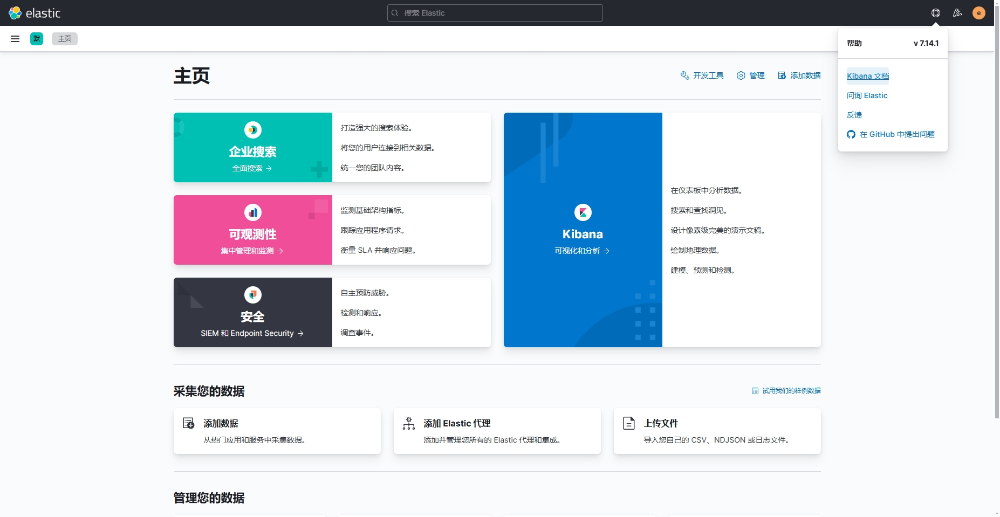

# EFK

`Elasticsearch` + `Filebeat` + `Kibana` 搭建日志监控系统

1. `Filebeat` 采集日志，相比Logstash更加轻量级和易部署，对系统资源开销更小，如果对于日志不需要进行过滤分析的，可以直接使用filebeat
2. `Elasticsearch` 日志搜索
3. `Kibana` 日志展示

### 安装部署
```shell
# 运行
sh install.sh
```

1. ES访问地址：[`ip地址:9200`](http://192.168.235.104:9200)
   默认账号密码：`elastic/123456`
2. kibana访问地址：[`ip地址:5601`](http://192.168.235.104:5601)
   默认账号密码：`elastic/123456`

### 示例图
