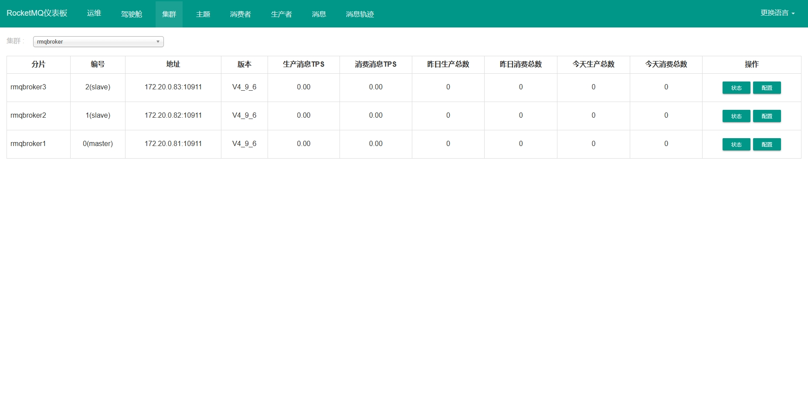

# RocketMQ 主从版

https://rocketmq.apache.org/zh/docs/4.x/quickstart/01quickstart

### 部署方式

```shell
sh install.sh
```

### Maven依赖

```xml

<dependency>
    <groupId>org.apache.rocketmq</groupId>
    <artifactId>rocketmq-client</artifactId>
    <version>4.9.6</version>
</dependency>
```

### 生产者 官方示例

```java
import org.apache.rocketmq.client.producer.DefaultMQProducer;
import org.apache.rocketmq.client.producer.SendResult;
import org.apache.rocketmq.common.message.Message;

public class ProducerExample {
    public static void main(String[] args) throws Exception {
        // 创建生产者实例，并设置生产者组名
        DefaultMQProducer producer = new DefaultMQProducer("please_rename_unique_group_name");
        // 设置 Name Server 地址，此处为示例，实际使用时请替换为真实的 Name Server 地址
        producer.setNamesrvAddr("localhost:9876");
        producer.start();

        try {
            // 创建消息实例，指定 topic、Tag和消息体
            Message msg = new Message("TestTopic", "TagA", ("Hello RocketMQ").getBytes());
            // 发送消息并获取发送结果
            SendResult sendResult = producer.send(msg);
            System.out.println("Message sent: " + new String(msg.getBody()));
            System.out.println("Send result: " + sendResult);
        } catch (Exception e) {
            e.printStackTrace();
            System.out.println("Message sending failed.");
        } finally {
            // 关闭生产者
            producer.shutdown();
        }
    }
}
```

### 消费者 官方示例

```java
import org.apache.rocketmq.client.consumer.DefaultMQPushConsumer;
import org.apache.rocketmq.client.consumer.listener.ConsumeConcurrentlyContext;
import org.apache.rocketmq.client.consumer.listener.ConsumeConcurrentlyStatus;
import org.apache.rocketmq.client.consumer.listener.MessageListenerConcurrently;
import org.apache.rocketmq.common.message.MessageExt;

import java.util.List;

public class ConsumerExample {
    public static void main(String[] args) throws Exception {
        // 创建消费者实例，并设置消费者组名
        DefaultMQPushConsumer consumer = new DefaultMQPushConsumer("please_rename_unique_group_name");
        // 设置 Name Server 地址，此处为示例，实际使用时请替换为真实的 Name Server 地址
        consumer.setNamesrvAddr("localhost:9876");
        // 订阅指定的主题和标签（* 表示所有标签）
        consumer.subscribe("TestTopic", "*");

        // 注册消息监听器
        consumer.registerMessageListener(new MessageListenerConcurrently() {
            @Override
            public ConsumeConcurrentlyStatus consumeMessage(List<MessageExt> msgs, ConsumeConcurrentlyContext context) {
                for (MessageExt msg : msgs) {
                    System.out.println("Received message: " + new String(msg.getBody()));
                }
                return ConsumeConcurrentlyStatus.CONSUME_SUCCESS;
            }
        });

        // 启动消费者
        consumer.start();
        System.out.println("Consumer started.");
    }
}
```

### 访问地址

访问地址：http://192.168.235.104:8080

### 示例



