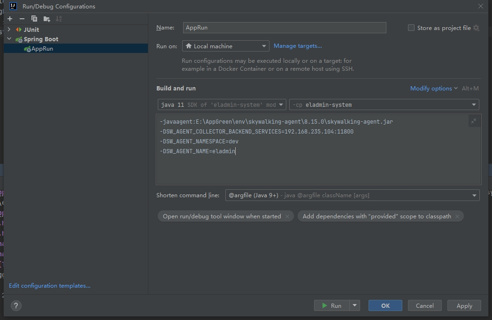

# Apache SkyWalking

分布式系统的应用程序性能监控工具，特别为微服务、云原生和基于容器(Kubernetes)架构设计。

- https://github.com/apache/skywalking
- https://skywalking.apache.org

### 部署方式
```shell
sh install.sh
```

访问 http://192.168.235.104:18080

### Java项目配置

下载`Java Agent` https://skywalking.apache.org/downloads/

> eg: https://dlcdn.apache.org/skywalking/java-agent/8.15.0/apache-skywalking-java-agent-8.15.0.tgz

修改`skywalking-agent\config\agent.config`中配置参数 或 在jvm运行的时候指定

在java项目运行启动的时候，添加如下运行参数

```shell
-javaagent:E:\AppGreen\env\skywalking-agent\8.15.0\skywalking-agent.jar \
-DSW_AGENT_COLLECTOR_BACKEND_SERVICES=192.168.235.104:11800
-DSW_AGENT_NAMESPACE=yourAppEnv \
-DSW_AGENT_NAME=yourAppName
```


项目跑起来之后，如果访问不了，就多重启几次oap-ui

调用下接口，就可以去SkyWalking中查看拓扑图，追踪等信息了
