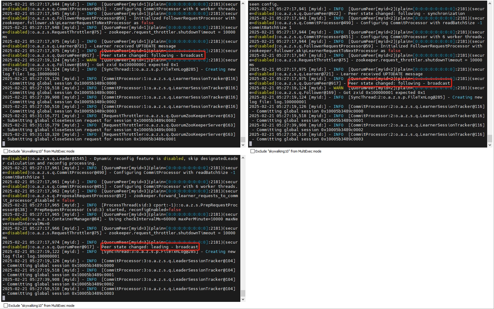

# Apache Zookeeper 集群

开源的分布式协调服务，主要用于分布式系统中的配置管理、命名服务、分布式同步和集群管理等

- https://zookeeper.apache.org/doc/r3.8.4/zookeeperStarted.html

### 部署方式
```shell
sh install.sh
```

### 客户端
```shell
# 项目地址
https://github.com/vran-dev/PrettyZoo

# 访问地址
192.168.235.104:2181
```

### 示例图

